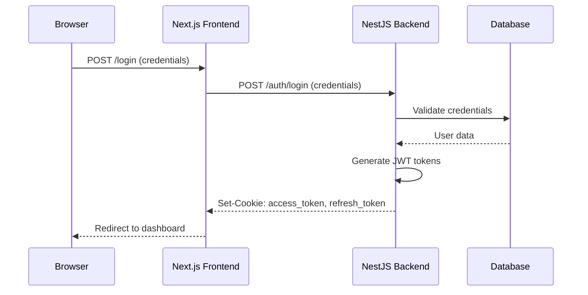
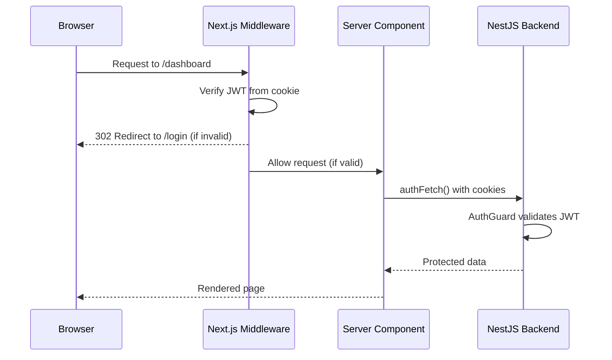
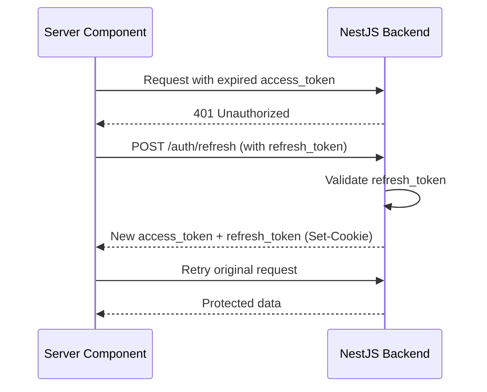

# SponsiWise Frontend Security Documentation

## Overview

This document provides a comprehensive explanation of the frontend security architecture for the SponsiWise platform. The security system is designed with a **defense-in-depth** approach, implementing multiple layers of protection at the middleware, API client, and backend levels.

---

## Table of Contents

1. [Architecture Overview](#architecture-overview)
2. [Authentication Flow](#authentication-flow)
3. [Middleware Layer Security](#middleware-layer-security)
4. [API Client Security](#api-client-security)
5. [Server-Side Fetch Security](#server-side-fetch-security)
6. [Route Protection](#route-protection)
7. [Cookie Security](#cookie-security)
8. [Token Management](#token-management)
9. [Error Handling](#error-handling)
10. [Role-Based Access Control (RBAC)](#role-based-access-control-rbac)
11. [Security Headers & CORS](#security-headers--cors)
12. [Request Flow Diagram](#request-flow-diagram)

---

## Architecture Overview

```
┌─────────────────────────────────────────────────────────────────────────────┐
│                           CLIENT BROWSER                                    │
│  ┌─────────────────┐    ┌─────────────────┐    ┌─────────────────────────┐ │
│  │  Public Pages   │    │ Protected Pages   │    │  API Requests           │ │
│  │  (No Auth)      │    │ (Auth Required)   │    │  (Authenticated)      │ │
│  └────────┬────────┘    └────────┬────────┘    └───────────┬─────────────┘ │
└───────────┼──────────────────────┼─────────────────────────┼───────────────┘
            │                      │                         │
            ▼                      ▼                         ▼
┌─────────────────────────────────────────────────────────────────────────────┐
│                      NEXT.JS MIDDLEWARE (Edge Runtime)                        │
│  ┌────────────────────────────────────────────────────────────────────────┐ │
│  │  1. Route Matching (findRouteRule)                                     │ │
│  │  2. JWT Verification (jose library)                                    │ │
│  │  3. Role Validation                                                    │ │
│  │  4. Redirect Handling                                                  │ │
│  └────────────────────────────────────────────────────────────────────────┘ │
└─────────────────────────────────────────────────────────────────────────────┘
            │                      │                         │
            ▼                      ▼                         ▼
┌─────────────────────────────────────────────────────────────────────────────┐
│                         SERVER COMPONENTS / ACTIONS                           │
│  ┌─────────────────┐    ┌─────────────────┐    ┌─────────────────────────┐   │
│  │  authFetch()    │    │  getServerUser()│    │  apiClient (Browser)    │   │
│  │  (Server-side)  │    │  (Server-side)  │    │  (Client-side)          │   │
│  └────────┬────────┘    └────────┬────────┘    └───────────┬─────────────┘   │
└───────────┼──────────────────────┼─────────────────────────┼───────────────────┘
            │                      │                         │
            └──────────────────────┴─────────────────────────┘
                                   │
                                   ▼
┌─────────────────────────────────────────────────────────────────────────────┐
│                         BACKEND API (NestJS)                                │
│  ┌────────────────────────────────────────────────────────────────────────┐ │
│  │  1. AuthGuard (JWT Verification)                                       │ │
│  │  2. RoleGuard (Role Validation)                                        │ │
│  │  3. TenantGuard (Multi-tenancy)                                       │ │
│  │  4. Rate Limiting (Throttler)                                         │ │
│  └────────────────────────────────────────────────────────────────────────┘ │
└─────────────────────────────────────────────────────────────────────────────┘
```

---

## Authentication Flow

### 1. Login Flow



### 2. Authenticated Request Flow



### 3. Token Refresh Flow



---

## Middleware Layer Security

**File:** `src/middleware.ts`

The middleware is the **first line of defense** for all incoming requests. It runs on the Edge Runtime and performs stateless JWT verification.

### Key Security Features:

#### 1. Route Matching
```typescript
const rule = findRouteRule(pathname);
if (!rule) {
  return NextResponse.next(); // Public route, allow through
}
```

#### 2. JWT Verification with `jose`
```typescript
const token = request.cookies.get("access_token")?.value;
const secret = new TextEncoder().encode(JWT_SECRET);
const { payload } = await jwtVerify(token, secret);
```

**Why `jose`?**
- **Stateless**: No database calls required
- **Edge-compatible**: Works in Next.js Edge Runtime
- **Secure**: Uses Web Crypto API

#### 3. Role-Based Redirects
```typescript
// USER role users trying to access /dashboard → redirect to /onboarding
if (userRole === "USER" && pathname.startsWith("/dashboard")) {
  return NextResponse.redirect(new URL("/onboarding", request.url));
}
```

#### 4. Role Enforcement
```typescript
if (rule.roles && !rule.roles.includes(userRole)) {
  return NextResponse.redirect(new URL("/unauthorized", request.url));
}
```

#### 5. Secure Redirect to Login
```typescript
function redirectToLogin(request: NextRequest, callbackPath: string) {
  const loginUrl = new URL("/login", request.url);
  loginUrl.searchParams.set("callbackUrl", callbackPath);
  return NextResponse.redirect(loginUrl);
}
```

### Middleware Matcher Configuration
```typescript
export const config = {
  matcher: [
    "/((?!_next/static|_next/image|favicon\\.ico|.*\\.(?:svg|png|jpg|jpeg|gif|webp)$).*)",
  ],
};
```
- **Excludes**: Static files, images, favicon
- **Includes**: All other routes (pages, API, etc.)

---

## API Client Security

### Server-Side: `authFetch()` 
**File:** `src/lib/auth-fetch.ts`

The `authFetch` function is the **primary secure fetch utility** for Server Components and Server Actions.

#### Security Features:

##### 1. Cookie Forwarding
```typescript
const cookieStore = await cookies();
const cookieHeader = cookieStore
  .getAll()
  .map((c) => `${c.name}=${c.value}`)
  .join("; ");

// Forward cookies to backend
headers: {
  "Content-Type": "application/json",
  Cookie: cookieHeader,
}
```

##### 2. Automatic Token Refresh (401 Handling)
```typescript
if (res.status === 401) {
  // Attempt refresh
  const refreshRes = await fetch(`${baseUrl}/auth/refresh`, {
    method: "POST",
    headers: { Cookie: cookieHeader },
  });

  if (!refreshRes.ok) {
    throw new AuthError("Session expired. Please log in again.");
  }

  // Write new cookies to store
  await writeCookiesToStore(refreshRes.headers.getSetCookie());
  
  // Retry original request
  const retryRes = await fetch(`${baseUrl}${normalizedEndpoint}`, {
    headers: { Cookie: updatedCookieHeader },
  });
}
```

##### 3. Secure Cookie Writing
```typescript
async function writeCookiesToStore(setCookieHeaders: string[]): Promise<void> {
  for (const setCookieValue of setCookieHeaders) {
    const { name, value, options } = parseSetCookieHeader(setCookieValue);
    
    cookieStore.set(name, value, {
      path: options.path || "/",
      httpOnly: options.httpOnly ?? true,
      sameSite: options.sameSite as "lax" | "strict" | "none" | undefined,
      secure: options.secure ?? process.env.NODE_ENV === "production",
      maxAge: options.maxAge,
    });
  }
}
```

##### 4. Error Classification
```typescript
// AuthError for session expiration
throw new AuthError("Session expired. Please log in again.");

// HttpError for other HTTP errors
throw new HttpError(res.status, res.statusText, message, code);
```

### Client-Side: `apiClient`
**File:** `src/lib/api-client.ts`

For Client Components, the `apiClient` provides a simpler interface:

#### Security Features:

##### 1. Proxy Path for CORS Avoidance
```typescript
function getBaseUrl(): string {
  // For browser requests, use the proxy path to avoid CORS issues
  if (typeof window !== 'undefined') {
    return '/api';
  }
  // Server-side: use the full URL from env
  return API_BASE_URL;
}
```

##### 2. Credentials Inclusion
```typescript
config.credentials = "include"; // Include cookies in client-side requests
```

##### 3. Error Handling
```typescript
export class ApiError extends Error {
  constructor(
    public status: number,
    public statusText: string,
    public detail?: string,
  ) {
    super(detail || statusText);
  }
}
```

---

## Server-Side Fetch Security

### `getServerUser()` Function
**File:** `src/lib/auth.ts`

Used in Server Components to get the current authenticated user:

```typescript
export async function getServerUser(): Promise<AuthUser | null> {
  const cookieStore = await cookies();
  const cookieHeader = cookieStore
    .getAll()
    .map((c) => `${c.name}=${c.value}`)
    .join("; ");

  const res = await fetch(`${baseUrl}/auth/me`, {
    method: "GET",
    headers: {
      "Content-Type": "application/json",
      Cookie: cookieHeader,
    },
    cache: "no-store", // Don't cache user identity
  });

  if (!res.ok) return null;
  return res.json();
}
```

**Security Considerations:**
- ✅ Uses `cache: "no-store"` to prevent user identity caching
- ✅ Forwards all cookies to backend
- ✅ Returns `null` on any error (fail-safe)
- ✅ Server-side only (uses `cookies()` from next/headers)

---

## Route Protection

**File:** `src/lib/route-config.ts`

### Route Rules Configuration

```typescript
export const protectedRoutes: RouteRule[] = [
  // Onboarding routes — auth required but NO role restriction
  { path: "/onboarding" },
  { path: "/sponsor/register" },
  { path: "/sponsor/pending" },
  { path: "/organizer/register" },

  // Any authenticated user
  { path: "/dashboard" },
  { path: "/settings" },
  { path: "/notifications" },

  // Role-specific areas
  { path: "/admin", roles: ["ADMIN", "SUPER_ADMIN"] },
  { path: "/manager", roles: ["MANAGER"] },
  { path: "/sponsor", roles: ["SPONSOR"] },
  { path: "/organizer", roles: ["ORGANIZER"] },
];
```

### Route Matching Logic

```typescript
export function findRouteRule(pathname: string): RouteRule | undefined {
  return protectedRoutes.find(
    (rule) => pathname === rule.path || pathname.startsWith(rule.path + "/"),
  );
}
```

**Priority Rules:**
1. **First match wins**: Order matters in `protectedRoutes`
2. **Prefix matching**: `/admin` matches `/admin`, `/admin/users`, etc.
3. **Exact matching**: `/dashboard` matches only `/dashboard` and `/dashboard/*`

---

## Cookie Security

### Cookie Configuration (Backend)

**File:** `sponsiwise_backend/src/auth/auth.controller.ts`

#### Access Token Cookie
```typescript
private setAccessTokenCookie(res: Response, accessToken: string): void {
  const isProduction = this.isProduction();
  const isLocalhost = this.isLocalhost();
  
  const cookieOptions = {
    httpOnly: true,                    // ❌ Not accessible via JavaScript
    secure: isProduction,            // ✅ HTTPS only in production
    sameSite: isProduction ? 'none' : 'lax',  // Cross-site in production
    maxAge: 15 * 60 * 1000,          // 15 minutes
    path: '/',
    domain: isProduction ? '.sponsiwise.app' : undefined,  // Cross-subdomain
  };

  res.cookie('access_token', accessToken, cookieOptions);
}
```

#### Refresh Token Cookie
```typescript
private setRefreshTokenCookie(res: Response, refreshToken: string): void {
  const cookieOptions = {
    httpOnly: true,
    secure: isProduction,
    sameSite: isProduction ? 'none' : 'lax',
    maxAge: 7 * 24 * 60 * 60 * 1000, // 7 days
    path: isProduction ? '/auth' : '/',  // Restricted path in production
    domain: isProduction ? '.sponsiwise.app' : undefined,
  };

  res.cookie('refresh_token', refreshToken, cookieOptions);
}
```

### Cookie Security Features

| Feature | Access Token | Refresh Token | Purpose |
|---------|-------------|---------------|---------|
| `httpOnly` | ✅ Yes | ✅ Yes | Prevents XSS attacks |
| `secure` | ✅ (prod) | ✅ (prod) | HTTPS only |
| `sameSite` | `none` (prod) / `lax` (dev) | `none` (prod) / `lax` (dev) | CSRF protection |
| `path` | `/` | `/auth` (prod) / `/` (dev) | Scope restriction |
| `domain` | `.sponsiwise.app` | `.sponsiwise.app` | Cross-subdomain |
| `maxAge` | 15 minutes | 7 days | Token lifetime |

### Environment Detection
```typescript
private isProduction(): boolean {
  const isOnRender = process.env.RENDER === 'true';
  const isOnVercel = process.env.VERCEL === '1';
  const isDeployed = isOnRender || isOnVercel;
  return nodeEnv === 'production' && isDeployed;
}

private isLocalhost(): boolean {
  return (
    host.includes('localhost') ||
    host.includes('127.0.0.1') ||
    nodeEnv === 'development'
  );
}
```

---

## Token Management

### JWT Token Structure

#### Access Token
- **Lifetime**: 15 minutes
- **Contains**: User ID, role, tenant ID, permissions
- **Usage**: API authentication
- **Storage**: HTTP-only cookie

#### Refresh Token
- **Lifetime**: 7 days
- **Contains**: Token ID, user ID, expiration
- **Usage**: Obtain new access token
- **Storage**: HTTP-only cookie (path-restricted)
- **Database**: Stored hashed in database for revocation

### Token Rotation
```typescript
async refresh(@Req() req: Request, @Res({ passthrough: true }) res: Response) {
  const incomingRefreshToken = req.cookies?.refresh_token;
  
  // Validate and revoke old refresh token
  const { accessToken, refreshToken, user } = 
    await this.authService.refreshTokens(incomingRefreshToken);

  // Set new token pair
  this.setAccessTokenCookie(res, accessToken);
  this.setRefreshTokenCookie(res, refreshToken);
}
```

**Security Benefits:**
- ✅ **Token rotation**: New refresh token on every use
- ✅ **Revocation**: Old tokens invalidated in database
- ✅ **Detection**: Reuse of revoked tokens triggers security alert

---

## Error Handling

**File:** `src/lib/errors/fetch-errors.ts`

### Error Hierarchy

```
FetchError
├── AuthError (401, session expired)
└── HttpError (other HTTP errors)
    ├── 401 Unauthorized
    ├── 403 Forbidden
    ├── 404 Not Found
    └── 5xx Server Error
```

### AuthError
```typescript
export class AuthError extends Error {
  readonly code: "AUTH_EXPIRED" = "AUTH_EXPIRED";
  readonly status: number = 401;

  constructor(message = "Session expired. Please log in again.") {
    super(message);
    this.name = "AuthError";
  }

  static isAuthError(error: unknown): error is AuthError {
    return error instanceof AuthError;
  }
}
```

### HttpError
```typescript
export class HttpError extends Error {
  readonly status: number;
  readonly statusText: string;
  readonly code?: string;

  constructor(status: number, statusText: string, message?: string, code?: string) {
    super(message || statusText);
    this.status = status;
    this.code = code;
  }

  isUnauthorized(): boolean { return this.status === 401; }
  isForbidden(): boolean { return this.status === 403; }
  isNotFound(): boolean { return this.status === 404; }
  isServerError(): boolean { return this.status >= 500; }
}
```

### Type Guard for Auth Errors
```typescript
export function isAuthRelatedError(error: unknown): boolean {
  if (AuthError.isAuthError(error)) return true;
  if (HttpError.isHttpError(error) && error.isUnauthorized()) return true;
  return false;
}
```

### Usage in Components
```typescript
try {
  const data = await authFetch("/api/protected");
} catch (error) {
  if (isAuthRelatedError(error)) {
    redirect("/login");
  }
  // Handle other errors
}
```

---

## Role-Based Access Control (RBAC)

### User Roles
```typescript
export enum UserRole {
  ADMIN = 'ADMIN',
  MANAGER = 'MANAGER',
  ORGANIZER = 'ORGANIZER',
  SPONSOR = 'SPONSOR',
  USER = 'USER',  // Unonboarded user
}
```

### Role Hierarchy & Permissions

| Role | Description | Access Level |
|------|-------------|--------------|
| `SUPER_ADMIN` | Platform administrator | Full platform access |
| `ADMIN` | Tenant administrator | Tenant-scoped admin access |
| `MANAGER` | Platform manager | Company verification, event approval |
| `ORGANIZER` | Event organizer | Create/manage events, view proposals |
| `SPONSOR` | Event sponsor | Browse events, submit proposals |
| `USER` | Registered user | Onboarding only |

### Frontend Role Enforcement

#### 1. Middleware Level
```typescript
if (rule.roles && !rule.roles.includes(userRole)) {
  return NextResponse.redirect(new URL("/unauthorized", request.url));
}
```

#### 2. Special Role Handling
```typescript
// USER role users trying to access /dashboard → redirect to /onboarding
if (userRole === "USER" && pathname.startsWith("/dashboard")) {
  return NextResponse.redirect(new URL("/onboarding", request.url));
}
```

#### 3. Backend Role Guard
```typescript
@Controller('admin')
@UseGuards(AuthGuard, RoleGuard)
@Roles('ADMIN', 'SUPER_ADMIN')
export class AdminController {
  // Only ADMIN and SUPER_ADMIN can access
}
```

---

## Security Headers & CORS

### Next.js Configuration
**File:** `next.config.ts`

```typescript
const nextConfig: NextConfig = {
  // Proxy API requests to backend to avoid CORS/cookie issues in development
  async rewrites() {
    return [
      {
        source: '/api/:path*',
        destination: 'http://localhost:3000/:path*',
      },
    ];
  },
};
```

### Security Benefits of Proxy
- ✅ **No CORS issues**: Same-origin requests
- ✅ **Cookie forwarding**: Automatic cookie handling
- ✅ **Simplified client**: No base URL configuration needed
- ✅ **Environment consistency**: Same code for dev/prod

### Backend CORS Configuration
```typescript
// Backend allows credentials and specific origins
app.enableCors({
  origin: process.env.FRONTEND_URL,
  credentials: true,
  methods: ['GET', 'POST', 'PUT', 'PATCH', 'DELETE'],
  allowedHeaders: ['Content-Type', 'Authorization'],
});
```

---

## Request Flow Diagram

### Complete Security Flow

```
┌─────────────────────────────────────────────────────────────────────────────┐
│  1. BROWSER REQUEST                                                         │
│     URL: /sponsor/dashboard                                                 │
│     Cookies: access_token=xxx; refresh_token=yyy                            │
└─────────────────────────────────────────────────────────────────────────────┘
                                      │
                                      ▼
┌─────────────────────────────────────────────────────────────────────────────┐
│  2. NEXT.JS MIDDLEWARE (Edge Runtime)                                       │
│                                                                             │
│  a. Match route: /sponsor → Rule found: { path: "/sponsor", roles: ["SPONSOR"] } │
│  b. Extract access_token from cookies                                        │
│  c. Verify JWT with jose:                                                   │
│     - Decode token                                                          │
│     - Validate signature (HS256)                                            │
│     - Check expiration                                                      │
│  d. Extract role from payload: role: "SPONSOR"                            │
│  e. Validate role: "SPONSOR" in ["SPONSOR"] → ✅ ALLOWED                   │
│                                                                             │
│  Result: NextResponse.next() → Continue to page                            │
└─────────────────────────────────────────────────────────────────────────────┘
                                      │
                                      ▼
┌─────────────────────────────────────────────────────────────────────────────┐
│  3. SERVER COMPONENT (Server-Side Rendering)                                │
│                                                                             │
│  a. Component calls: await authFetch("/sponsor/dashboard/stats")            │
│                                                                             │
│  b. authFetch() execution:                                                  │
│     - Get cookies from next/headers                                         │
│     - Forward cookies to backend                                            │
│     - Backend returns 401 (token expired)                                   │
│                                                                             │
│  c. Automatic token refresh:                                               │
│     - Call POST /auth/refresh with refresh_token                            │
│     - Backend validates refresh_token in database                           │
│     - Backend generates new token pair                                       │
│     - Write new cookies to next/headers                                     │
│                                                                             │
│  d. Retry original request with new cookies                                  │
│     - Backend validates new access_token                                    │
│     - Returns protected data                                                │
│                                                                             │
│  e. Return data to component                                                 │
└─────────────────────────────────────────────────────────────────────────────┘
                                      │
                                      ▼
┌─────────────────────────────────────────────────────────────────────────────┐
│  4. BACKEND API (NestJS)                                                    │
│                                                                             │
│  a. Request arrives at: GET /sponsor/dashboard/stats                       │
│                                                                             │
│  b. AuthGuard execution:                                                   │
│     - Extract access_token from cookies                                     │
│     - Verify JWT signature with JWT_ACCESS_SECRET                           │
│     - Validate token claims                                                 │
│     - Attach user payload to request                                        │
│                                                                             │
│  c. RoleGuard execution:                                                    │
│     - Check if user.role === "SPONSOR"                                      │
│     - Validate against required roles                                       │
│                                                                             │
│  d. TenantGuard execution:                                                  │
│     - Extract tenantId from token                                           │
│     - Validate tenant access                                                │
│                                                                             │
│  e. Controller handler execution                                            │
│     - Access user via @CurrentUser() decorator                              │
│     - Query database with tenant scoping                                    │
│                                                                             │
│  f. Response with protected data                                             │
└─────────────────────────────────────────────────────────────────────────────┘
                                      │
                                      ▼
┌─────────────────────────────────────────────────────────────────────────────┐
│  5. RESPONSE TO BROWSER                                                     │
│                                                                             │
│  - HTML page with rendered data                                             │
│  - Set-Cookie headers (if tokens were refreshed)                            │
│  - HTTP-only cookies updated in browser                                     │
└─────────────────────────────────────────────────────────────────────────────┘
```

---

## Security Checklist

### ✅ Implemented Security Measures

| Layer | Security Measure | Implementation |
|-------|-----------------|----------------|
| **Transport** | HTTPS | `secure: true` in production |
| **Cookies** | HTTP-only | `httpOnly: true` for all auth cookies |
| **Cookies** | SameSite | `none` (prod) / `lax` (dev) |
| **Cookies** | Path restriction | `/` (access), `/auth` (refresh) |
| **Cookies** | Domain scoping | `.sponsiwise.app` for cross-subdomain |
| **Tokens** | Short-lived access | 15 minutes |
| **Tokens** | Refresh token rotation | New token on every refresh |
| **Tokens** | Database revocation | Refresh tokens stored hashed |
| **Middleware** | Stateless JWT verify | `jose` library |
| **Middleware** | Role validation | Route-config based |
| **API** | Automatic refresh | `authFetch()` 401 handling |
| **API** | Error classification | `AuthError` vs `HttpError` |
| **Backend** | JWT verification | `AuthGuard` with `jsonwebtoken` |
| **Backend** | Role guards | `RoleGuard` with `@Roles()` decorator |
| **Backend** | Rate limiting | `@Throttle()` on auth endpoints |
| **Backend** | Token expiration | Automatic 401 on expired tokens |

---

## Best Practices for Developers

### 1. Always Use `authFetch()` for Server Components
```typescript
// ✅ CORRECT
import { authFetch } from "@/lib/auth-fetch";
const data = await authFetch("/api/protected");

// ❌ INCORRECT - Don't use regular fetch
const data = await fetch("/api/protected"); // No cookie forwarding!
```

### 2. Handle Auth Errors Properly
```typescript
import { isAuthRelatedError } from "@/lib/errors/fetch-errors";

try {
  const data = await authFetch("/api/protected");
} catch (error) {
  if (isAuthRelatedError(error)) {
    redirect("/login?callbackUrl=/protected");
  }
  throw error; // Re-throw other errors
}
```

### 3. Use `getServerUser()` for User Data
```typescript
import { getServerUser } from "@/lib/auth";

export default async function Page() {
  const user = await getServerUser();
  if (!user) redirect("/login");
  
  return <Dashboard user={user} />;
}
```

### 4. Protect Routes in Middleware Config
```typescript
// Add new protected routes to route-config.ts
export const protectedRoutes: RouteRule[] = [
  // ... existing routes
  { path: "/new-feature", roles: ["ADMIN"] },
];
```

### 5. Never Access Cookies in Client Components
```typescript
// ❌ NEVER DO THIS in Client Components
document.cookie; // XSS vulnerability!

// ✅ Use apiClient instead
import { apiClient } from "@/lib/api-client";
apiClient.get("/api/data"); // Cookies sent automatically
```

---

## Troubleshooting

### Common Issues

#### 1. 401 Errors After Login
**Cause**: Cookie not being set or sent
**Check**:
- Browser DevTools → Application → Cookies
- Verify `access_token` and `refresh_token` are set
- Check cookie attributes (httpOnly, secure, sameSite)

#### 2. CORS Errors
**Cause**: Direct API calls without proxy
**Solution**: Use `/api` proxy path in client-side code

#### 3. Token Refresh Loop
**Cause**: Refresh token expired or revoked
**Solution**: Clear cookies and re-login

#### 4. Role Access Denied
**Cause**: User role doesn't match route requirement
**Check**: Middleware logs for role validation

---

## Conclusion

The SponsiWise frontend security architecture implements a **comprehensive, multi-layered defense system**:

1. **Edge Layer**: Middleware validates JWT without database calls
2. **Application Layer**: Server components use secure fetch with auto-refresh
3. **Transport Layer**: HTTP-only cookies with secure attributes
4. **Backend Layer**: Multiple guards validate tokens, roles, and tenants

This design ensures **security without sacrificing performance**, using stateless verification where possible and automatic token refresh for seamless user experience.

---

*Document Version: 1.0*
*Last Updated: 2024*
*Applies to: SponsiWise Frontend v1.0+*
